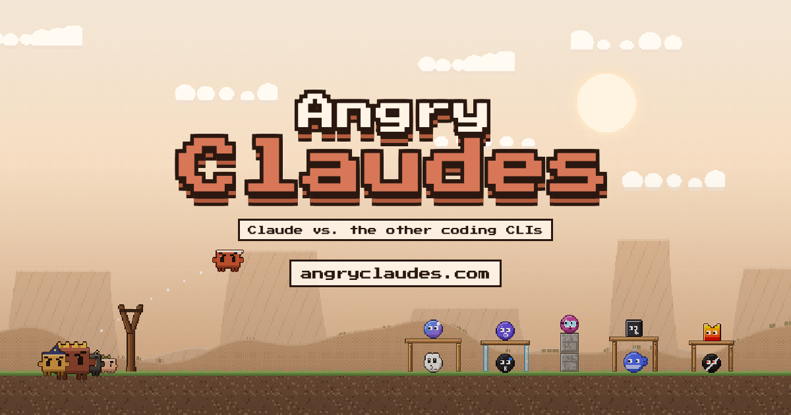

# Angry Claudes: demo

**Play the full game at [angryclaudes.com](https://angryclaudes.com)**

Angry Birds, except Claude is on the slingshot and the other AI coding CLIs are hiding in the forts. Knock down Codex, Gemini, Kimi, Qwen, Copilot, DeepSeek, Cursor, Grok, Mistral and the codex-max boss.

This repository hosts the free demo, chapter one with five levels: **[kom1sh.github.io/angry-claudes](https://kom1sh.github.io/angry-claudes/)**.

The full game at [angryclaudes.com](https://angryclaudes.com) has 25 levels in five chapters: Localhost, Staging, Production with the codex-max boss, The Cloud (cloud servers in space with their own gravity) and Code Freeze (ice, ropes, CI/CD lifts and node_modules crates). Achievements unlock one-shot slingshot power-ups: Debug mode, sudo, Max plan, Chaos Monkey, Rubber Duck Storm and Hotfix. Five golden rubber ducks are hidden in the levels.

## The Claudes

| Model | Power |
| --- | --- |
| Claude | Tap mid-flight: a “You’re absolutely right!” shout that blows light blocks away |
| Haiku | Splits into three. Cuts through glass |
| Sonnet | Straight-line dash. Splinters wood |
| Opus | Heavy. Breaks stone |
| /compact | Compresses the context around him, loudly |
| Fable | Drops a volley of explosive Easter eggs (full game) |

## Controls

Drag Claude back on the slingshot and let go. Tap or press Space mid-flight to use the power. Scroll to zoom, drag the background to look around, R restarts, Esc pauses. English and Russian.

## Under the hood

Box2D physics via planck.js, pixel art drawn in code, sounds synthesized with WebAudio, no image or audio files. TypeScript and Vite. Built with Claude Code.

---

A fan-made parody. Not affiliated with Anthropic, OpenAI, Google, GitHub, Anysphere, xAI, Mistral AI, Moonshot AI, Alibaba or DeepSeek. All trademarks belong to their owners.
